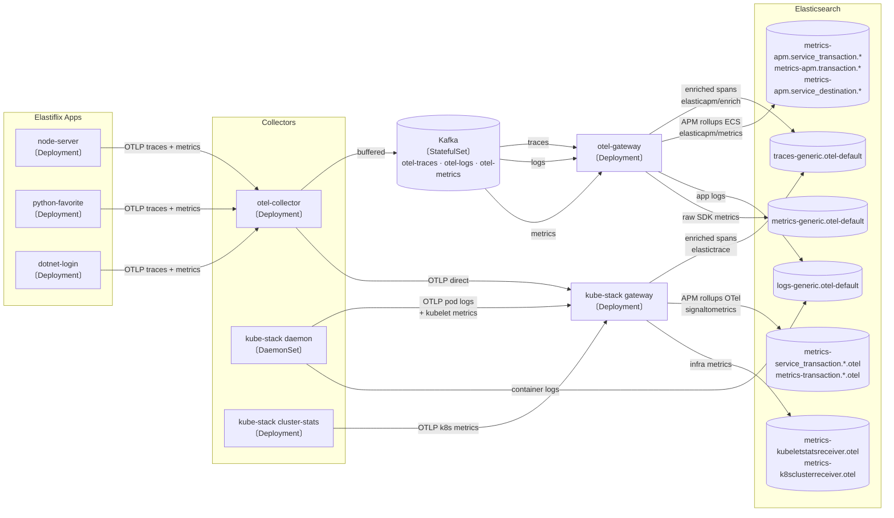

# Telemetry Data Flow

This document describes how telemetry flows from the Elastiflix demo services through the collector pipeline and into Elasticsearch.

## Architecture Diagram

---

## Signal Breakdown

### Traces

| Index | Producer | Enrichment processor | APM fields |
|---|---|---|---|
| `traces-generic.otel-default` | otel-gateway | `elasticapm/enrich` | `transaction.*`, `event.outcome`, `processor.event`, `user_agent.*` parsed from `http.user_agent` |
| `traces-generic.otel-default` | kube-stack gateway | `elastictrace` | `transaction.*`, `event.outcome`, `processor.event`, `status.code` preserved |

Both processors produce the same core APM semantic fields. The differences are minor:
- `elasticapm/enrich` parses `http.user_agent` into structured `user_agent.name/original/version`
- `elastictrace` preserves the raw OTel `status.code` field

### APM Rollup Metrics

Pre-aggregated latency histograms used by Kibana APM latency, throughput, and error rate charts.

| Index | Producer | ES mapping | Field layout |
|---|---|---|---|
| `metrics-apm.service_transaction.1m-default` | otel-gateway (`elasticapm/metrics`) | ECS | `service.name`, `transaction.type` at top level |
| `metrics-service_transaction.1m.otel-default` | kube-stack gateway (`signaltometrics`) | OTel | `resource.attributes.service.name`, `attributes.transaction.type` nested |

The histogram values are equivalent — the difference is purely structural (ECS flattened vs OTel nested).

### Infrastructure Metrics

Collected only by the kube-stack daemon and cluster-stats collectors — the APM pipeline never sees these.

| Index | Source | Content |
|---|---|---|
| `metrics-kubeletstatsreceiver.otel-default` | kube-stack daemon | Pod/container CPU, memory, network |
| `metrics-k8sclusterreceiver.otel-default` | kube-stack cluster-stats | Deployment replicas, node conditions, pod phases |
| `metrics-hostmetricsreceiver.otel-default` | kube-stack daemon | Host CPU, disk, network (Docker Desktop: limited) |
| `metrics-system.cpu.otel-default` etc. | kube-stack gateway (ECS path) | Same kubelet/host data in ECS field names |

### Logs

| Index | Source | Content |
|---|---|---|
| `logs-generic.otel-default` | otel-gateway (via Kafka) | App-emitted log records from Elastiflix SDKs |
| `logs-generic.otel-default` | kube-stack daemon (filelog) | Container stdout/stderr enriched with K8s pod metadata |

---

## Kafka as a Buffer

The otel-collector fans out to **both** Kafka and the kube-stack gateway simultaneously. Kafka adds 2–5 seconds of latency before the otel-gateway consumes the data. The kube-stack gateway receives the same OTLP payload immediately with no buffering.

This means each Elastiflix span is written to `traces-generic.otel-default` **twice** — once from each gateway — with the same `span_id` but different `_id` (ES auto-generates the document ID). In production you would choose one enrichment path and remove the other.

---

## Namespace Map

| Component | Kubernetes namespace |
|---|---|
| Elastiflix demo services | `elastiflix` |
| otel-collector (first hop) | `otel-collector` |
| Kafka broker | `kafka` |
| otel-gateway (APM pipeline) | `otel-gateway` |
| kube-stack operator + collectors | `opentelemetry-operator-system` |
| Elasticsearch | `elastic` |
| Kibana | `elastic` |
